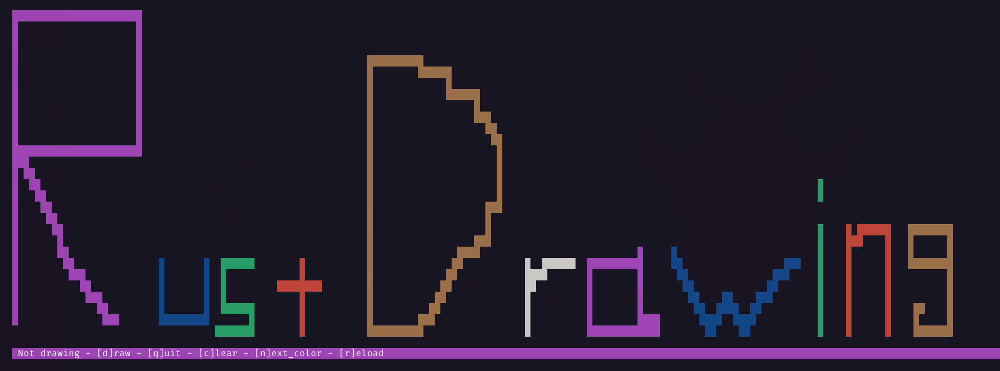

# Rust-drawing ✏️



✏️🦀 Rust drawing allows you to draw incredible and admirable art in your terminal

# Installation 📦

## Arch Linux 🐧

rust-drawing is available in the [AUR](https://aur.archlinux.org/packages/rust-drawing) repository.

```
yay -S rust-drawing
```

## Other 🪟🐧

### With make - linux 🐧

build with make

```bash
# 📂 /rust-drawing/
make
```

copy the binary to the bin folder

```
# 📂 /rust-drawing/
make install
```

### Build from source - Linux 🐧 and Windows 🐧

build with [cargo](https://www.rust-lang.org/tools/install).

```bash
# 📂 /rust-drawing/
cargo build --release
```

**[ LINUX ONLY ]** : Move the binary

```bash
# 📂 /rust-drawing/
sudo cp target/release/rust-drawing /usr/bin/bin/rust-drawing
```

**On windows** the executable will be `target\release\rust-drawing.exe` you can move it wherever you want.


# Usage 📝

**Use arrow keys to move the cursor**

- **[ D ]** : Toggle drawing mode
- **[ Q ]** : Quit
- **[ C ]** : Clear the screen
- **[ N ]** : New colors
- **[ R ]** : Reload pixels (if you change the size of the terminal for example)

# Docker 🐳

## Run the latest verison

```bash
docker run --rm -it ghcr.io/skwalexe/rust-drawing:main
```

## Test your changes 🚧

### Build 🛠️

```bash
# 📂 /rust-drawing/
docker build -t rust-drawing .
```

### Run 🚀

```bash
docker run --rm -it rust-drawing
```

# Uninstall 🗑

## With make

run make uninstall

```bash
# 📂 /rust-drawing/
make uninstall
```

## Remove the binary

```bash
rm /usr/bin/rust-drawing
```

# final

If you have any problem, don't hesitate to open an issue

# contributing

Pull requests are welcome. For major changes, please open an issue first to discuss what you would like to change.

<a href="https://github.com/SkwalExe#ukraine"></a>